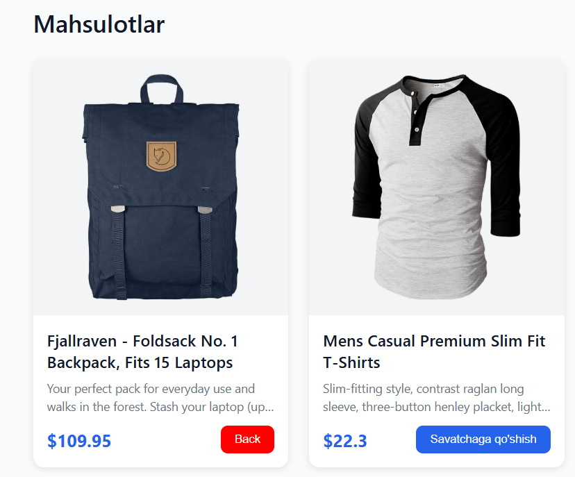
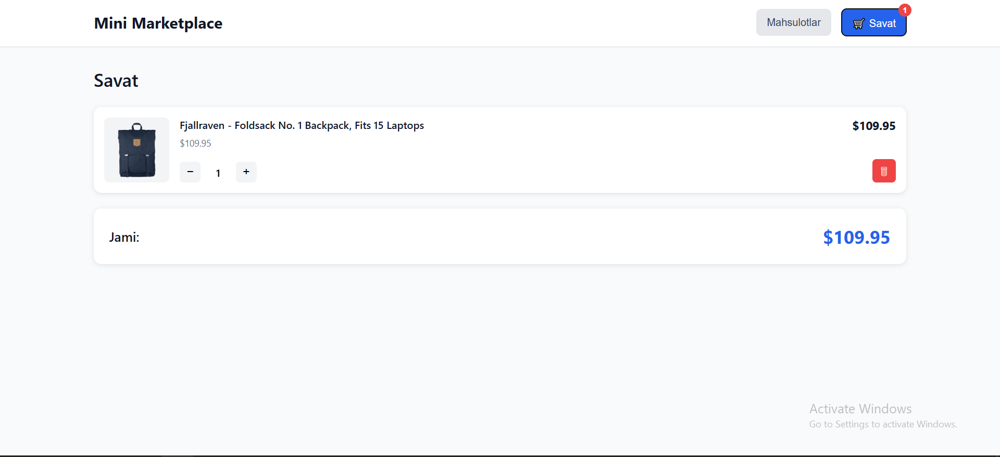

# click_intern

Mini Marketplace ilovasi

📋 Loyiha haqida
Bu loyiha oddiy onlayn marketplace ilovasi bo'lib, foydalanuvchilar mahsulotlarni ko'rishlari va savatga qo'shishlari mumkin. Ilova React yordamida yaratilgan va localStorage'da ma'lumotlarni saqlaydi.

👤 Ism
Axmedov Amirshoh

⏱️ Vazifa qancha vaqt oldi
Taxminiy vaqt: 2-3 soat

😓 Qiyin bo'lgan joylar

1. Responsive dizaynni sozlash
   Muammo: Mahsulot kartalarini turli ekran o'lchamlarida (mobil, planshet, desktop) chiroyli ko'rsatish
   Yechim: CSS Grid va media queries yordamida moslashuvchan layout yaratish, aspect-ratio ishlatish

2. Mahsulot rasmlarini to'g'ri joylash
   Muammo: API'dan kelgan rasmlar turli o'lchamda va nisbatda, ba'zilari kichik, ba'zilari katta
   Yechim: object-fit: contain va max-width/max-height kombinatsiyasi bilan rasmlarni konteynerga sig'dirish

3. Savat badge'ini to'g'ri joylashtirish
   Muammo: Kichik qizil badge'ni tugma ustida absolute position bilan aniq joylashtirish
   Yechim: position: relative (parent) va position: absolute (badge) kombinatsiyasi, top/right parametrlari

4. Mahsulot tavsifini cheklash
   Muammo: Ba'zi mahsulotlar juda uzun tavsifga ega, karta balandligi turlicha bo'lib qoladi
   Yechim: CSS -webkit-line-clamp bilan 2 qatordan keyin text truncate qilish va "..." qo'shish

Skrinshotlar:

